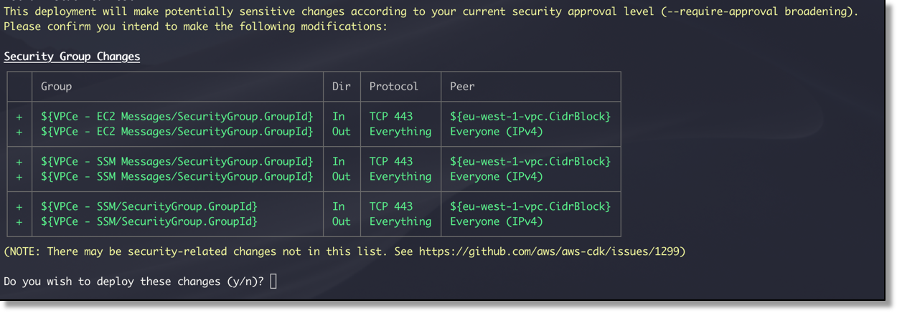
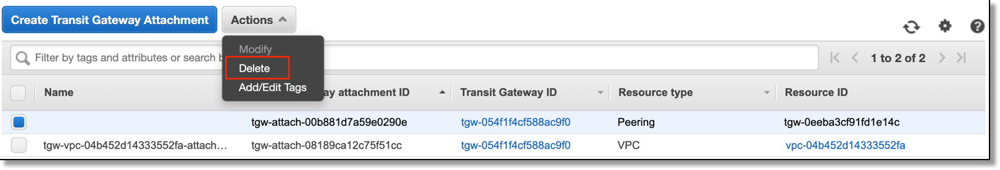

# Creating a global network with AWS Transit Gateway Peering and the AWS CDK

> This CDK project goes through the creation of a global network that spans multiple AWS Regions using AWS Transit Gateway inter-region peering.

## Solution Overview

The following diagram will be our CDK project's reference point.

While the transit gateway only connects to VPCs within the same region, you can establish peering connections between transit gateways in different AWS Regions. This lets you build global, cloud-based networks.

## Deployment Steps

Pre-requisites:

-	an [AWS account](https://signin.aws.amazon.com/signin?redirect_uri=https%3A%2F%2Fportal.aws.amazon.com%2Fbilling%2Fsignup%2Fresume&client_id=signup)
-	Installed and authenticated [AWS CLI](https://docs.aws.amazon.com/cli/latest/userguide/cli-chap-install.html)
-	Installed [Python 3.6+](https://www.python.org/downloads/)
-	Installed [AWS CDK](https://docs.aws.amazon.com/cdk/latest/guide/getting_started.html#getting_started_install)

Using your device’s command line, check out the Git repository to a local directory on your device:
`git clone https://github.com/aws-samples/aws-cdk-transit-gateway-peering`

Manually create a virtualenv on MacOS and Linux:
`python3 -m venv .env`

After the init process completes and the virtualenv is created, activate your virtualenv:
`source .env/bin/activate`

(optional) If you’re using Windows, you would activate the virtualenv like this:
`.env\Scripts\activate.bat`

Install the required dependencies:
`pip install -r requirements.txt`

Synthesize the CloudFormation template for this code to verify that all the requirements are installed and available:
`cdk synth`

Deploy the solution:
`cdk deploy "*"`

By default, some actions that could potentially make sensitive security changes, require approval. In this deployment, you will be creating an IAM role for the EC2 instances and creating security groups. Whenever prompted, enter “y”:

You can override this prompt by providing an additional flag to the deployment command:
`cdk deploy "*" --require-approval never`

While the AWS CDK deploys the CloudFormation stacks, you can follow the deployment progress in your terminal:

The code in the github project will deploy the resources required for the solution in both regions, including VPCs, transit gateways and EC2 instances.

The deployment is divided into four stacks, two in each region. The first is the network deployment and the second is the deployment of the EC2 instances, and there is an explicit dependency stated that the EC2 stack depends on the network stack.

The relevant code in the app.py file is shown below:

network_stack_us_east_1 = Network(app, "network-stack-us-east-1",
        cidr_range="172.16.0.0/24",
        tgw_asn=64512,
        env={
            'region': 'us-east-1',
        }
    )

network_stack_eu_west_1 = Network(app, "network-stack-eu-west-1",
        cidr_range="172.16.1.0/24",
        tgw_asn=64513,
        env={
            'region': 'eu-west-1',
        }
    )

ec2_stack_us_east_1 = Ec2(app, id="instance-stack-us-east-1",
        network_stack=network_stack_us_east_1, 
        env={
            'region': 'us-east-1',
        }
    )

ec2_stack_eu_west_1 = Ec2(app, id="instance-stack-eu-west-1",
        network_stack=network_stack_eu_west_1, 
        env={
            'region': 'eu-west-1',
        }
    )
ec2_stack_us_east_1.add_dependency(network_stack_us_east_1)
ec2_stack_eu_west_1.add_dependency(network_stack_eu_west_1)

Once the stacks have successfully been deployed, utilize the [AWS CLI](https://docs.aws.amazon.com/cli/latest/userguide/cli-chap-install.html) to establish a peering connection between the two transit gateways. Presently, the AWS CDK does not yet natively support the provisioning of peering connections.

tgw_us_east_1=$(aws ec2 describe-transit-gateways \
--region us-east-1 --filters "Name=state,Values=available" \
--query "TransitGateways[*].TransitGatewayId" --output text)

tgw_eu_west_1=$(aws ec2 describe-transit-gateways \
--region eu-west-1 --filters "Name=state,Values=available" \
--query "TransitGateways[*].TransitGatewayId" --output text)

account_id=$(aws ec2 describe-transit-gateways \
--region us-east-1 --filters "Name=state,Values=available" \
--query "TransitGateways[*].OwnerId" --output text)

aws ec2 create-transit-gateway-peering-attachment \
--transit-gateway-id $tgw_us_east_1 \
--peer-transit-gateway-id $tgw_eu_west_1 \
--peer-account-id $account_id --peer-region eu-west-1 \
--region us-east-1

attachment_id=$(aws ec2 describe-transit-gateway-peering-attachments \
--region us-east-1 \
--query "TransitGatewayPeeringAttachments[].TransitGatewayAttachmentId" \
--output text)

It takes about thirty seconds for peering connection’s state change to change from “initiatingRequest” to “pendingAcceptance”. Run the following command to validate that the peering connection’s state is showing as “pendingAcceptance”:

aws ec2 describe-transit-gateway-peering-attachments --region us-east-1

Accept the peering request:

aws ec2 accept-transit-gateway-peering-attachment \
--transit-gateway-attachment-id $attachment_id \
--region eu-west-1

It can take up to 10 minutes for the peering connection to be established. Run the following command to validate that the peering connection’s state is showing as “available”:

aws ec2 describe-transit-gateway-peering-attachments --region us-east-1

Update the route tables on each of the transit gateways:

tgw_rt_id_us_east_1=$(aws ec2 describe-transit-gateway-attachments \
--region us-east-1 \
--filters Name=resource-type,Values=peering Name=state,Values=available \
--query "TransitGatewayAttachments[*].Association.TransitGatewayRouteTableId" \
--output text)

tgw_attachment_id_us_east_1=$(aws ec2 describe-transit-gateway-attachments \
--region us-east-1 \
--filters Name=resource-type,Values=peering Name=state,Values=available \
--query "TransitGatewayAttachments[*].TransitGatewayAttachmentId" \
--output text)

aws ec2 create-transit-gateway-route \
--destination-cidr-block 172.16.1.0/24 \
--transit-gateway-route-table-id $tgw_rt_id_us_east_1 \
--transit-gateway-attachment-id $tgw_attachment_id_us_east_1 \
--region us-east-1

tgw_rt_id_eu_west_1=$(aws ec2 describe-transit-gateway-attachments \
--region eu-west-1 \
--filters Name=resource-type,Values=peering Name=state,Values=available \
--query "TransitGatewayAttachments[*].Association.TransitGatewayRouteTableId" \
--output text) 

tgw_attachment_id_eu_west_1=$(aws ec2 describe-transit-gateway-attachments \
--region eu-west-1 \
--filters Name=resource-type,Values=peering Name=state,Values=available \
--query "TransitGatewayAttachments[*].TransitGatewayAttachmentId" \
--output text)

aws ec2 create-transit-gateway-route \
--destination-cidr-block 172.16.0.0/24 \
--transit-gateway-route-table-id $tgw_rt_id_eu_west_1 \
--transit-gateway-attachment-id $tgw_attachment_id_eu_west_1 \
--region eu-west-1

## Verification Steps

To perform verification, log into the AWS Management Console, select the us-east-1 region and navigate to the EC2 service. Select “running instances” and select the EC2 instance that was previously created. Scroll down and take note of the private IP address. Also, take note of the private IP address for the EC2 instance in the eu-west-1 region. 

Select the EC2 instance in one of the regions and click on the Connect button. For the connection method, select Session Manager and click on Connect:

Perform a ping to the EC2 instance in the opposite region’s private IP address in order to confirm end-to-end network reachability:
`ping [private IP address in opposite region]`

If the ping packets are transmitted and received as in the next screenshot, congratulations! You’ve properly enabled transit gateway peering and validated end to end IP connectivity across.

If you are not seeing the received pings, go through the previous steps to ensure that you haven’t missed anything or made any misconfigurations.

## Cleanup

Follow these steps to remove the resources that were deployed in this post.

In the AWS Management Console, delete the static route with the “Peering Connection” resource type that was created in each region’s transit gateway’s route table:

Delete the transit gateway peering attachment in one of the regions:

Terminate the rest of the resources with the following command:
`cdk destroy "*"`

When asked to confirm the deletion of the four stacks, select “y”.

## License

This library is licensed under the MIT-0 License. See the LICENSE file.