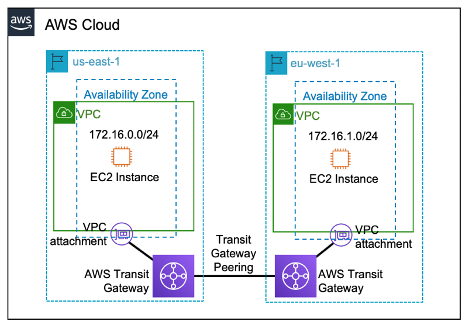
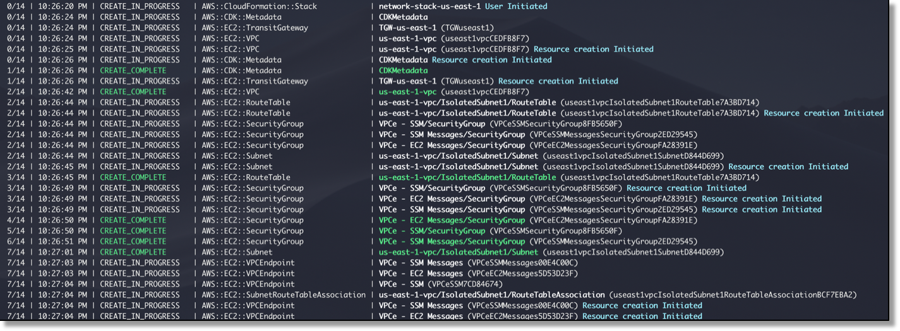
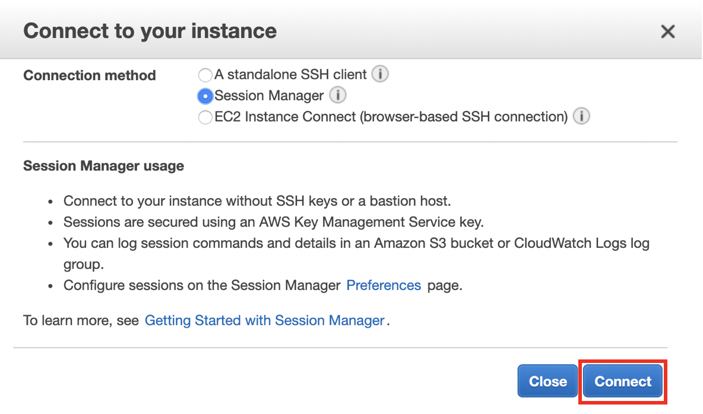
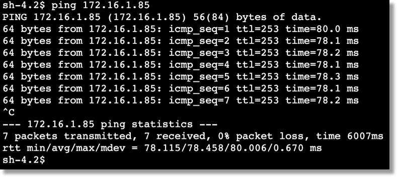

# Creating a global network with AWS Transit Gateway Peering and the AWS CDK

> This CDK project goes through the creation of a global network that spans multiple AWS Regions using AWS Transit Gateway inter-region peering.

## Solution Overview

The following diagram will be referred to throughout this project.



While the transit gateway only connects to VPCs within the same region, you can establish peering connections between transit gateways in different AWS Regions. This lets you build global, cloud-based networks.

## Deployment Steps

Pre-requisites:

-	an [AWS account](https://aws.amazon.com/) without any existing transit gateways in us-east-1 or eu-west-1
-	[AWS CLI, authenticated and configured](https://docs.aws.amazon.com/cli/latest/userguide/cli-configure-files.html)
-	[Python 3.6+](https://www.python.org/downloads/)
-	[AWS SDK for Python (Boto3)](https://aws.amazon.com/sdk-for-python/)
-	[AWS CDK](https://docs.aws.amazon.com/cdk/latest/guide/getting_started.html#getting_started_install)
-	[Git](http://git-scm.com/downloads)

Step 1: Using your device’s command line, check out our Git repository to a local directory on your device:

`git clone https://github.com/aws-samples/aws-cdk-transit-gateway-peering`

Step 2: Change directories to the new directory that was created:

`cd aws-cdk-transit-gateway-peering/`

Step 2a: Copy the following json document to tell the AWS CDK which command to use to run your app. Note that this is for Windows only:

Windows: `copy cdk-linux-windows.json cdk.json /Y`

Step 3: Create a virtual environment:

MacOS/Linux: `python3 -m venv .env`<br />
Windows: `python -m venv .env`

Step 4: After the init process completes and the virtual environment is created, activate it:

MacOS/Linux: `source .env/bin/activate`
Windows: `.env\Scripts\activate.bat`

Step 5: Install the required dependencies:

`pip3 install -r requirements.txt`

Step 6: Synthesize the templates. Note that because AWS CDK apps are only a definition of the infrastructure using code, when they’re executed they produce, or “synthesize” an AWS CloudFormation template for each stack defined in the application:

`cdk synthesize`

Step 7: Deploy the solution. By default, some actions could potentially make security changes, require approval. In this deployment, you will be creating an IAM role for the EC2 instances and creating security groups. The following command will override the approval prompts but if you would like to manually accept the prompts, omit the “—require-approval never” flag:

`cdk deploy "*" --require-approval never`

While the AWS CDK deploys the CloudFormation stacks, you can follow the deployment progress in your terminal:



The code in the GitHub project will deploy the resources required for the solution in both regions, us-east-1 and eu-west-1, including VPCs, transit gateways and EC2 instances.

The deployment is divided into four stacks, two per region. The first is the deployment of the network and the second is the deployment of the EC2 instances, and there is an explicit dependency stated that the EC2 stack depends on the network stack.

The relevant code in the `app.py` file is shown below:


```
network_stack_us_east_1 = Network(app, "network-stack-us-east-1",
        cidr_range="172.16.0.0/24",
        tgw_asn=64512,
        env={
            'region': 'us-east-1',
        }
    )

network_stack_eu_west_1 = Network(app, "network-stack-eu-west-1",
        cidr_range="172.16.1.0/24",
        tgw_asn=64513,
        env={
            'region': 'eu-west-1',
        }
    )

ec2_stack_us_east_1 = Ec2(app, id="instance-stack-us-east-1",
        network_stack=network_stack_us_east_1, 
        env={
            'region': 'us-east-1',
        }
    )

ec2_stack_eu_west_1 = Ec2(app, id="instance-stack-eu-west-1",
        network_stack=network_stack_eu_west_1, 
        env={
            'region': 'eu-west-1',
        }
    )
ec2_stack_us_east_1.add_dependency(network_stack_us_east_1)
ec2_stack_eu_west_1.add_dependency(network_stack_eu_west_1)
```

Step 8: Once the stacks have successfully been deployed, you’ll execute a series of Python scripts which were obtained when you checked out our Git repo during step 1. Python scripts are required as transit gateway peering is not yet natively supported by AWS CloudFormation. The first script establishes the transit gateway peering connection:

MacOS/Linux: `python3 create-tgw-peering.py`
Windows: `python create-tgw-peering.py`

Initially, the peering connection’s state change will show as “initiatingRequest” but it’ll only remain that way for less than a minute. Run the following command every so often and validate that the peering connection’s state is showing as “pendingAcceptance” before proceeding to the next step:

`aws ec2 describe-transit-gateway-peering-attachments --region us-east-1`

Step 9: Accept the peering request:

MacOS/Linux: `python3 accept-tgw-peering.py`
Windows: `python accept-tgw-peering.py`

Shortly after accepting the peering request, the peering connection’s state will show as “pending”. After a few minutes, run the following command every so often and ensure that the peering connection’s state is showing as “available” before moving on to step 10:

`aws ec2 describe-transit-gateway-peering-attachments --region us-east-1`

Step 10: Once the peering connection has changed to “available”, add a route to the each of the transit gateways’ route table:

MacOS/Linux: `python3 create-tgw-routes.py`
Windows: `python create-tgw-routes.py`

To verify that that the Transit gateways are peered between the regions, proceed to the "Verification Steps" section below.

## Verification Steps

To perform verification, log into the AWS Management Console, select the us-east-1 region and navigate to the EC2 service. Select “running instances” and select the EC2 instance that was previously created. Scroll down and take note of the private IP address. Also, take note of the private IP address for the EC2 instance in the eu-west-1 region. 

Select the EC2 instance in one of the regions and click on the Connect button. For the connection method, select Session Manager and click on Connect:



Perform a ping to the EC2 instance in the opposite region’s private IP address in order to confirm end-to-end network reachability:

`ping [private IP address in opposite region]`

If the ping packets are transmitted and received as in the next screenshot, congratulations! You’ve properly enabled transit gateway peering and validated end to end IP connectivity across.



If you aren’t not seeing the received pings, go through the previous steps to ensure that you haven’t missed anything or made any misconfigurations.

## Cleanup

Follow these steps to remove the resources that were deployed in this post.

Step 1: Delete the two transit gateway routes that were created to send traffic across the peering connection and also delete the transit gateway peering connection:

MacOS/Linux: `python3 cleanup.py`
Windows: `python cleanup.py`

It will take a few minutes for the peering connection to be deleted. Run the following command to validate that the peering connection’s state is showing as “deleted” before proceeding to the next step:

`aws ec2 describe-transit-gateway-peering-attachments --region us-east-1`

Step 2:  Terminate the rest of the resources with the following command: 

`cdk destroy "*"`

When asked to confirm the deletion of the four stacks, select “`y`”.

## License

This library is licensed under the MIT-0 License. See the LICENSE file.